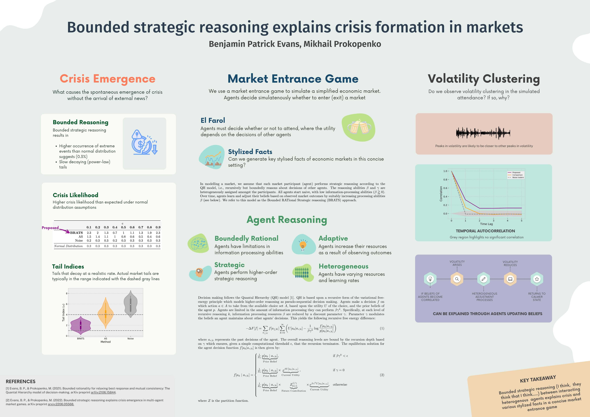

# Bounded strategic reasoning explains crisis emergence in multi-agent market games



A version of this work was presented at the Summer Institute on Bounded Rationality 2022, at the Max Planck Institute in Berlin, Germany.

## Multi-agent Market Games

This work follows along two key works. The [quantal hierarchy model of reasoning](https://arxiv.org/abs/2106.15844), and the [BRATS approach to market modelling](https://arxiv.org/abs/2206.05568).

### How to run

Setup the market model
```python
from src.market import Market
market = Market(N=100, c=0.6) # Initialise the basic model
```

Then to run for T timesteps use

```python
market.run(T=1000)
```

Alternatively, run for an individual tick with
```python
market.tick()
```

Finally, to obtain the results dictionary call
```python
results = market.results()
```

For an example of how to run this work for multiple runs, see run.py

## Citation

To cite the market model, please use

```
@article{evans2022bounded,
  title={Bounded strategic reasoning explains crisis emergence in multi-agent market games},
  author={Evans, Benjamin Patrick and Prokopenko, Mikhail},
  journal={arXiv preprint arXiv:2206.05568},
  year={2022},
  doi = {10.48550/ARXIV.2206.05568},
}
```

To cite the reasoning method (Quantal Hierarchy), please use

```
@article{evans2021bounded,
  title={Bounded rationality for relaxing best response and mutual consistency: The Quantal Hierarchy model of decision-making},
  author={Evans, Benjamin Patrick and Prokopenko, Mikhail},
  journal={arXiv preprint arXiv:2106.15844},
  year={2021},
  doi = {10.48550/ARXIV.2106.15844},
}
```

